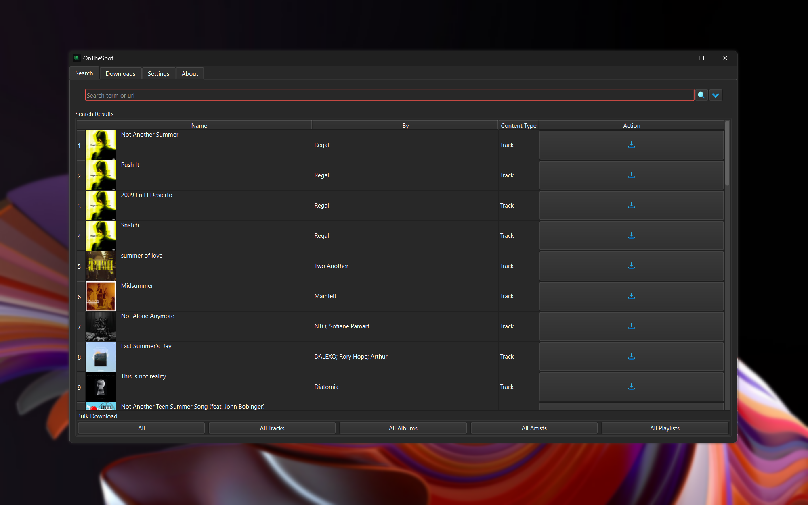

  <picture>
    <source media="(prefers-color-scheme: dark)" srcset="assets/01_Logo/Repository-Logo.png">
    <source media="(prefers-color-scheme: light)" srcset="assets/01_Logo/Repository-Logo.png">
    
  </picture>

[![Issues Badge][issues-shield]][issues-url]
[![Stars Badge][stars-shield]][stars-url]
[![Downloads Badge][downloads-shield]][downloads-url]
[![License Badge][license-shield]][license-url]

   

      Welcome to OnTheSpot!
       
      <a href="https://discord.gg/GCQwRBFPk9">Join Discord</a>
      ·
      <a href="https://github.com/justin025/OnTheSpot/issues/new?assignees=&labels=bug&projects=&template=bug-report.yml">Report Bug</a>
      ·
      <a href="https://github.com/justin025/OnTheSpot/issues/new?assignees=&labels=enhancement&projects=&template=feature_request.yml">Request Feature</a>
   

    

 

## What is OnTheSpot?

OnTheSpot is an open-source user-friendly music downloader built with Qt and Python. Inspired by the original [**OnTheSpot**](https://github.com/casualsnek/onthespot) and [**Zotify**](https://github.com/zotify-dev/zotify), made for educational and personal use only. You can search for songs, artists, albums, playlists, podcasts, and audiobooks and download them straight to your device. It's designed to work across multiple platforms, so anyone can enjoy their favourite music offline.

### Features

- [**Cross Platform**](https://www.techopedia.com/definition/17056/cross-platform) Available for Windows, MacOS, and Linux (Including AppImage, PKGBUILD, and eBuild).
- [**High Quality Downloads**](https://www.whathifi.com/advice/high-resolution-audio-everything-you-need-to-know) Download music up to 320kbps directly from the source.
- [**Multi Language Support**](https://phrase.com/blog/posts/multilingual-customer-support/) Download track and album names translated to your application's language.
- [**Comprehensive Content Coverage**](https://thisisglance.com/blog/why-spotify-is-the-outright-best-music-streaming-app) Supports songs, podcasts, playlists, albums, singles, compilations, and audiobooks.
- [**Rich Metadata Embedding**](https://sonosuite.com/en/blog/what-is-music-metadata-and-why-is-important-to-digital-music/) Automatically embed detailed metadata like artist, album, year, and lyrics.
- [**Custom Download Paths**](https://www.microsoft.com/en-us/microsoft-365/business-insights-ideas/resources/11-ideas-for-how-to-organize-digital-files) Set personalized paths for playlists and episodes for easy organization.
- [**Free and Premium Support**](https://community.spotify.com/t5/Social-Random/What-is-the-difference-between-free-Spotify-and-Premium/td-p/5478479) Compatible with both free and premium accounts.

> [!IMPORTANT]
> If you want to know more about the features, take a look at the application itself or check out our documentation.

## Getting Started

OnTheSpot is an open-source music search and download application. You can find what you need by entering queries or URLs and the app will locate the relevant media for you. Downloads are easy to manage with options to adjust settings, formats, and directories to your liking.

To begin, please refer to the following documents:

1. [**Installation Guide**](docs/installation.md)
2. [**Basic Usage Instructions**](docs/usage.md)

### Need More Help?

If you have any questions or run into issues while using OnTheSpot, feel free to ask by:

- [**Opening an Issue**](https://github.com/justin025/onthespot/issues)
- [**Joining Our Discord**](https://discord.gg/GCQwRBFPk9)

## Contributing

Contributions are welcome! If you encounter bugs, have suggestions, or would like to translate the app to your native language feel free to [**open an issue**](https://github.com/justin025/onthespot/issues) or submit a pull request.

For more detailed info, please read our [**Contributions**](docs/contributing.md) Document.

## Disclaimer

OnTheSpot is an open-source project designed to enhance your experience with legitimate music streaming subscriptions for **educational and personal use only**.

### Important Notice

- [**Educational and Personal Use Only**](docs/disclaimer.md#1-purpose-and-use)
- [**Independent Project**](docs/disclaimer.md#2-no-affiliation)
- [**Legal Compliance**](docs/disclaimer.md#3-legal-compliance)
- [**Usage Limitations**](docs/disclaimer.md#4-usage-limitations)
- [**Liability and Warranty**](docs/disclaimer.md#5-liability-and-warranty)
- [**Agreement and Modifications**](docs/disclaimer.md#6-agreement-and-modifications)

For full details, please read our [**Disclaimer**](docs/disclaimer.md).

## Contact Us

If you have any questions, concerns, or need assistance feel free to [contact us](mailto:justin026@protonmail.com).

<!-- Issues Badge -->
[issues-shield]: https://img.shields.io/github/issues/justin025/onthespot?style=flat&label=Issues&labelColor=001224&color=1DB954
[issues-url]: https://github.com/justin025/onthespot/issues
<!-- Stars Badge -->
[stars-shield]: https://img.shields.io/github/stars/justin025/onthespot?style=flat&label=Stars&labelColor=001224&color=1DB954
[stars-url]: https://github.com/justin025/onthespot/stargazers
<!-- Downloads Badge -->
[downloads-shield]: https://img.shields.io/github/downloads/justin025/onthespot/total.svg?style=flat&label=Downloads&labelColor=001224&color=1DB954
[downloads-url]: https://github.com/justin025/onthespot/releases/
<!-- License Badge -->
[license-shield]: https://img.shields.io/github/license/justin025/onthespot?style=flat&label=License&labelColor=001224&color=1DB954
[license-url]: https://github.com/justin025/onthespot/blob/main/LICENSE
